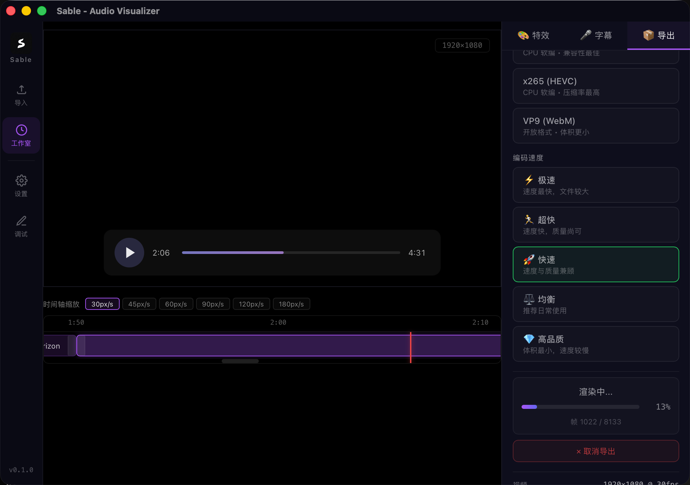
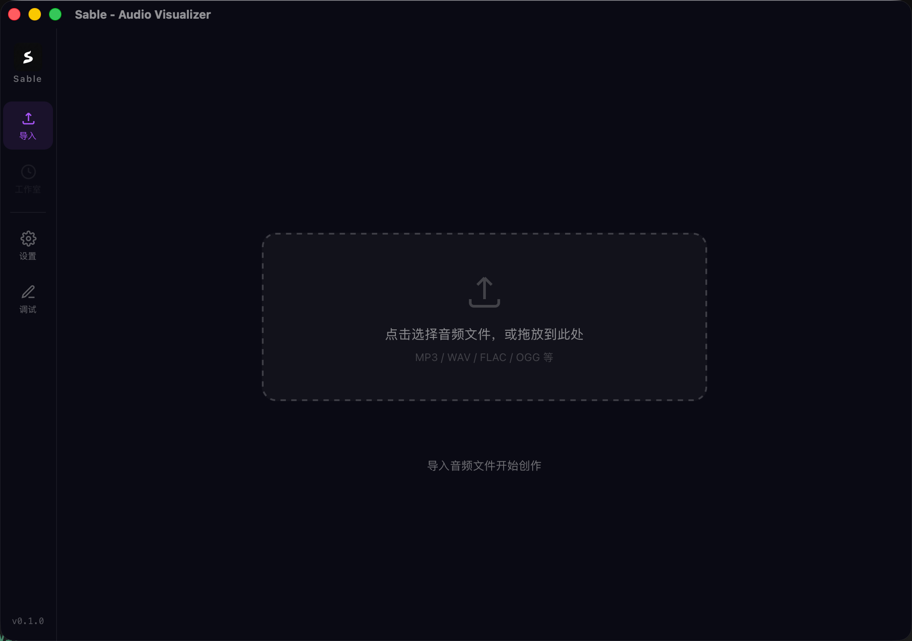

<div align="center">
    
    <h1>Sable</h1>
    <p>A special audio visualizer to generate videos. </p>
    <p><i>Primarily designed for launchpad performance videos.</i></p>
</div>

> [!WARNING]
> This project is under construction.

## Installation

FFmpeg is required, download it at https://www.ffmpeg.org/ and config the path in the app.

If the path you input is not found, the app will read ffmpeg in system PATH.

Download Pre-release from: [Releases](https://github.com/Vincent-the-gamer/sable/releases)

## Get the audio stems

You can split the audio into stems using:

- iZotope RX series(.../9/10/11/12/...).

or more tools.

## Dev

Clone this repo, and:

```bash
# or npm, yarn, bun, etc.
pnpm install
pnpm tauri dev
```

## Demo

https://www.bilibili.com/video/BV1jaKw6DEew

## Preview



